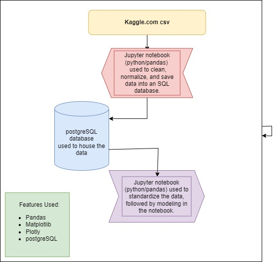

# Unsupervised Learning for Predictive Modeling 
This is the group repository for project 4, a machine learning project using a Kaggle dataset with shopping data from Hunter's E-Grocery.

# Project Overview:
To find a potential business problem worth analyzing and use machine learning to provide further insights.  Our team chose a large dataset from Kaggle.com to ensure any machine learning application will have ample data to model.

[Supermarket dataset for predictive marketing 2023](https://www.kaggle.com/datasets/hunter0007/ecommerce-dataset-for-predictive-marketing-2023/code)

# Project Contributors:
- Oluwatobi Adelaja
- Daniel King-Allen
- Anna Barbera
- Patrick Brennan
- Peter Warren

# Project Strategy:
1. Our first consideration was to make sure we chose a dataset that was complete enough to ensure we would have enough content to gain meaningful insights from a machine learning module, many of which do best with large amounts of data.   

    We first chose data from a Board Game API hoping to glean better understanding on the relation between game mechanics and user popularity, but after running into large swaths of incomplete data in that dataset leading to a small amount of usable information, we had to rethink our initial choice.   

    We chose to proceed with a different source as linked above regarding shopping trends for a grocery e-commerce chain called Hunter's Groceries.  This dataset was clean enough and large enough for us to feel confident in moving forward.
 

2.  Our next step was to prepare and process the data we had to further ensure the viability.  We cleaned and inspected the data, eliminating NaN values and checking for duplicates. We then saved this large amount of data in a postgreSQL database that we created separately on our own devices.  To replicate this project, please carefully read the notes in the 'ecom_etl' notebook before running any other notebooks.

3. After properly storing this database, we then accessed it for further inspection.  We chose to do an initial exploratory data analysis to visualize the data, looking for correlations and intiial insights into user trends, particularly the time of day they would place their orders.  

4.  Now that our data was clean, stored, and we felt we had a strong understanding of how we could best utilize it, we discussed a machine learning model.  We decided to use an unsupervised machine learning model called k-means clustering, as it can be particularly useful when there is no specific outcome variable one is trying to predict.  We chose to use it because we only have a set of features we wanted to use to find collections of customer observations that share similar characteristics.  To help further fine-tune our model, we also incorporated principal component analysis to further clarify our classifications, using that information to respec and hone our k-means clustering even further.

<b>The business implications are clear.  By forming clusters of customers based on similar shopping patterns, one could easily imagine marketing campaign specifications for each group based on those similarities.</b>